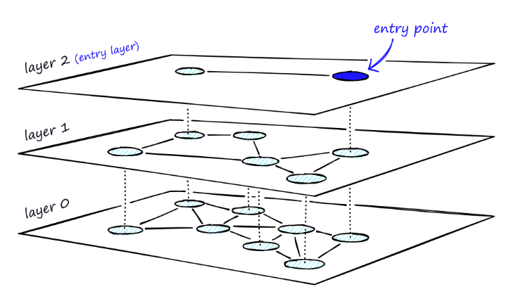
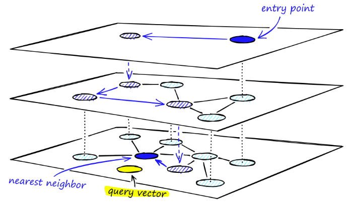

# Proyecto 3

# proyecto_2

|Nombre|Participación|Nota
|-|-|-|
|Francisco Magot|KNN Secuencial, KNN R-Tree, Experimentacion|100%|
|Eric Bracamonte|KNN Faiss, App en Flask|100%|

## Video de demostración

https://youtu.be/9dS-W3B6TUo

## Objetivos del proyecto

Usar librerías para implementar un servicio de reconocimiento facial con una búsqueda knn. Se desea
mostrar la diferencia de tiempos para cada método de indexación.

## Librerías usadas
- face_recognition
- python-rtree
- faiss (usando índice hnsw)

## Estrategia general y métodos implementados 

Para un reconocimiento facial necesitamos dos cosas: un repositorio de imágenes y estrategias de indexación para los vectores característicos. Por lo primero, 
obtuvimos un repositorio de más de 13 mil imágenes (lfw). Por lo segundo, se decidió probar con las siguientes estrategias:
- Sin índice (sequencial)
- Indexación con rtree 
- Indexación con Hierarchical Navigable Small Worlds (HNSW)

Para las 3 estrategia necesitamos tener una forma de obtener los vectores carácteristicos de cada imagen. Aquí es donde viene la libería face_recognition
con su función *face_encodings*. Esta extrae el vector característico para las caras de una imagen. Y aquí surge un problema: con estos vectores característicos, ¿cuándo se
va a construir el índice? Por ello, para tener un recuperamiento escalable de las imágenes, se consideró la idea de usar memoría secundaría para almacenar un índice. 

Para las 2 estrategias mencionadas con índices, el procedimiento es el siguiente: 
- Crear el índice usando un vector, almacenado en memoria secundaria, de objectos ImgObjects
- Guardar el índice en disco

Así lo único que tiene que hacer la aplicación al levantar es cargar un índice que ya esta creado en memoria secundaria. Para el knn tenemos las siguientes variantes:

1. KNN Secuencial

Con respecto a la búsqueda de KNN secuencial, se ha iterado por todas las imágenes dentro del folder "lfw". Para cada una de estas imágenes, se ha utilizado su vector característico correspondiente (utilizando la función face_encodings) para luego calcular la distancia euclideana a la imágen de búsquda (utilizando la función face_distance).
Se ha utilizado un max-heap para guardar los k elementos más cercanos.

2. KNN R-Tree

Con respecto a la búsqueda de KNN con R-Tree, se ha utilizado una libreria rtree en python. Dado a que el vector característico que devuelve la función face_encodings tiene 128 valores, se ha configurado el rtree para que soporte estas 128 dimensiones. Para conseguir los k vecinos más cercanos a la imágen de búsqeuda, se utilizará la función de la librería de rtree llamada "nearest". 

3. KNN Faiss (HNSW)

Luego, entendemos que la maldición de la dimensionalidad ocurre principalmente porque debido al número grande de dimensiones la data se va a encontrar muy esparcida. Una forma de atacar este problema es usar búsquedas aproximadas. Estas usan estimaciones para encontrar resultados, con una pequeña perdida de exactitud, de manera eficiente. Aquí es donde entra el HNSW, un índice de grafos que funciona con niveles creados en base a análisis de la distribución de la data. La idea para la structura es la siguiente:

- Tener vértices (vectores característicos) con un máximo numero de aristas. Estas aristas deben estar distribuidas de manera uniforme.
- Tener niveles en dónde en el más bajo los vértices tienen más aristas.

Se vería algo asi: 

Dónde el entry point es un nodo donde empieza la búsqueda. Este último algoritmo, con un query vector, hace lo siguiente:
- Desde el nodo actual busca el vecino mas cercano al query vector 
- Si el vecino más cercano es el nodo actual, se pasa al siguiente nivel. Si ya se encuentra en el último nivel, el nodo actual es el nodo deseado por el usuario
- Caso contrario, ir a ese vecino.

Esto es lo que usamos en faiss. Creamos un IndexHNSWFlat con nuestros vectores característicos y usamos el método search con n results. El cual usa distancia euclideana para compararse con los otros vértices.

## Experimentación

A continuación los tiempos de experimentación para los algoritmos implementados. Considerar que se utilizó un valor de K = 8 sobre una colección de imágenes de tamaño n. Todos los tiempos están expresados en segundos.

|n|KNN Secuencial|KNN RTree|KNN Faiss|
|-|-|-|-|
|100|0.0022|0.0004|0.0035|
|200|0.0039|0.0021|0.0001|
|400|0.0069|0.0025|0.0079|
|800|0.0146|0.0049|0.0002|
|1600|0.0264|0.0085|0.0001|
|3200|0.0548|0.0169|0.0001|
|6400|0.0983|0.0295|0.0002|
|12800|0.1914|0.065|0.0002|

El archivo para los tests se llama [experimentacion.py](./experimentacion.py).

## Levantar el proyecto

Se tiene que estar en un sistema operativo POSIX (LINUX o MAC) y ejecutar el [crear_indices.py](/crear_indices.py). En caso haya pasado algo con el archivo vector_imgs.npy,
ejecutar antes crear_vector_encodings. Finalmente, prender el servidor con *python app.py*.

